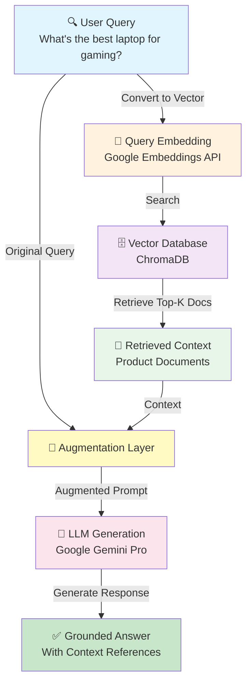

# 🛒 E-Commerce Product Recommendation System using RAG

A document-based intelligent Q&A and recommendation system built with Retrieval-Augmented Generation (RAG) architecture.


## 📋 Table of Contents

- [Overview](#overview)
- [Architecture](#architecture)
- [Setup Instructions](#setup-instructions)
- [API Documentation](#api-documentation)
- [Usage Examples](#usage-examples)
- [Design Decisions](#design-decisions)
- [Project Structure](#project-structure)

## 🎯 Overview

This system enables intelligent product search and recommendations by:

1. **Indexing** product documents (PDFs, TXT, Markdown)
2. **Retrieving** relevant information using semantic search
3. **Generating** accurate, context-grounded responses using LLM

### Key Features

- ✅ Multi-format document ingestion (PDF, TXT, MD)
- ✅ Semantic search using vector embeddings
- ✅ AI-powered responses grounded in product data
- ✅ RESTful API with FastAPI
- ✅ Persistent vector storage with ChromaDB

## 🏗️ Architecture



### RAG Workflow

The system operates in three distinct phases:

#### 1. **Retrieval Phase**

- User query is converted to vector embeddings using Google Embeddings API
- Semantic similarity search is performed against ChromaDB
- Top-K most relevant product documents are retrieved

#### 2. **Augmentation Phase**

- Retrieved context documents are combined with the original user query
- A comprehensive prompt is constructed: `User Query + Retrieved Context`
- This augmented prompt grounds the LLM response in actual product data

#### 3. **Generation Phase**

- Augmented prompt is sent to Google Gemini Pro LLM
- LLM generates accurate, context-grounded responses
- Response includes relevant product details and source references

## 🚀 Setup Instructions

### Prerequisites

- Python 3.9+
- Google Cloud API Key (for Gemini & Embeddings)

### Installation

1. **Clone the repository**

   ```bash
   git clone <repository-url>
   cd ecommerce-rag-system
   ```

2. **Create virtual environment**

   ```bash
   python -m venv venv
   source venv/bin/activate  # On Windows: venv\Scripts\activate
   ```

3. **Install dependencies**

   ```bash
   pip install -r requirements.txt
   ```

4. **Set up environment variables**

   ```bash
   cp .env.example .env
   # Edit .env and add your GOOGLE_API_KEY
   ```

5. **Run the application**

   ```bash
   python run.py
   ```

6. **Access the API**
   - API: http://localhost:8000
   - Swagger Docs: http://localhost:8000/docs
   - ReDoc: http://localhost:8000/redoc

## 📚 API Documentation

### Endpoints

| Method | Endpoint         | Description         |
| ------ | ---------------- | ------------------- |
| GET    | /                | API information     |
| GET    | /health          | Health check        |
| POST   | /upload          | Upload document     |
| POST   | /query           | Query products      |
| POST   | /query/recommend | Get recommendations |

### API Details

#### POST /upload

Upload and index a document.

**Request:**

```bash
curl -X POST "http://localhost:8000/upload" \
  -H "Content-Type: multipart/form-data" \
  -F "file=@products.pdf"
```

**Response:**

```json
{
  "success": true,
  "message": "Document processed and indexed successfully",
  "filename": "products.pdf",
  "chunks_created": 15,
  "timestamp": "2024-01-15T10:30:00"
}
```

#### POST /query

Query the product knowledge base.

**Request:**

```bash
curl -X POST "http://localhost:8000/query" \
  -H "Content-Type: application/json" \
  -d '{"query": "What are the best smartphones under $1000?", "top_k": 3}'
```

**Response:**

```json
{
  "query": "What are the best smartphones under $1000?",
  "answer": "Based on our product catalog, here are the best smartphones under $1000:\n\n1. **Google Pixel 8 Pro ($999)** - Best for AI features...",
  "source_documents": [...],
  "processing_time": 1.234
}
```

## 💡 Usage Examples

### Query Examples

#### Product Search

```bash
curl -X POST "http://localhost:8000/query" \
  -H "Content-Type: application/json" \
  -d '{"query": "I need a laptop for video editing"}'
```

#### Budget Query

```bash
curl -X POST "http://localhost:8000/query" \
  -H "Content-Type: application/json" \
  -d '{"query": "What is the best budget smartphone?"}'
```

#### Feature Comparison

```bash
curl -X POST "http://localhost:8000/query" \
  -H "Content-Type: application/json" \
  -d '{"query": "Compare iPhone 15 Pro Max with Samsung Galaxy S24 Ultra"}'
```

## 🎨 Design Decisions

### Why ChromaDB?

- **Simplicity:** Easy setup, no external services needed
- **Persistence:** Built-in local storage
- **Integration:** Native LangChain support
- **Performance:** Efficient for small-medium datasets (<1M vectors)

### Why Google Gemini?

- **Quality:** State-of-the-art language understanding
- **Cost:** Generous free tier for development
- **Integration:** LangChain support via langchain-google-genai
- **Speed:** Fast inference times

### Why This Chunking Strategy?

- **Chunk Size (500):** Balances context preservation with retrieval precision
- **Overlap (50):** Prevents information loss at chunk boundaries
- **Recursive Splitting:** Respects document structure (paragraphs, sentences)

### Error Handling Approach

- **Graceful degradation** when no documents match
- **Clear error messages** with HTTP status codes
- **Validation** at API layer using Pydantic

## 📁 Project Structure

```
ecommerce-rag-system/
├── app/
│   ├── __init__.py          # Package initialization
│   ├── main.py              # FastAPI application
│   ├── config.py            # Configuration management
│   ├── api/
│   │   └── routes/          # API endpoint definitions
│   ├── core/
│   │   ├── document_processor.py  # Document loading/chunking
│   │   ├── embeddings.py          # Embedding generation
│   │   ├── vector_store.py        # Vector DB operations
│   │   └── rag_pipeline.py        # RAG orchestration
│   ├── models/
│   │   └── schemas.py       # Pydantic models
│   └── utils/
│       └── helpers.py       # Utility functions
├── data/
│   └── sample_products/     # Sample documents
├── tests/
│   └── test_api.py          # API tests
├── requirements.txt
├── .env.example
└── README.md
```

## 🧪 Running Tests

```bash
# Run all tests
pytest tests/ -v

# Run with coverage
pytest tests/ -v --cov=app
```

---

## 🏃 Quick Start Commands

```bash
# 1. Setup
python -m venv venv
source venv/bin/activate  # Windows: venv\Scripts\activate
pip install -r requirements.txt

# 2. Configure
cp .env.example .env
# Add your GOOGLE_API_KEY to .env

# 3. Run
python run.py

# 4. Test (in another terminal)
# Upload sample data
curl -X POST "http://localhost:8000/upload" -F "file=@data/sample_products/smartphones.txt"
curl -X POST "http://localhost:8000/upload" -F "file=@data/sample_products/laptops.txt"

# Query
curl -X POST "http://localhost:8000/query" \
  -H "Content-Type: application/json" \
  -d '{"query": "What laptop do you recommend for a student?"}'
```
